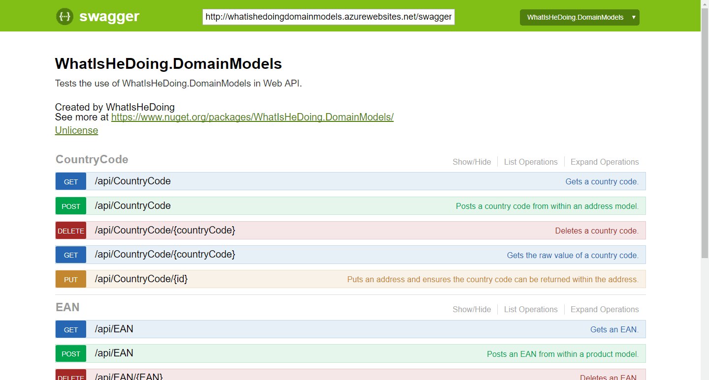
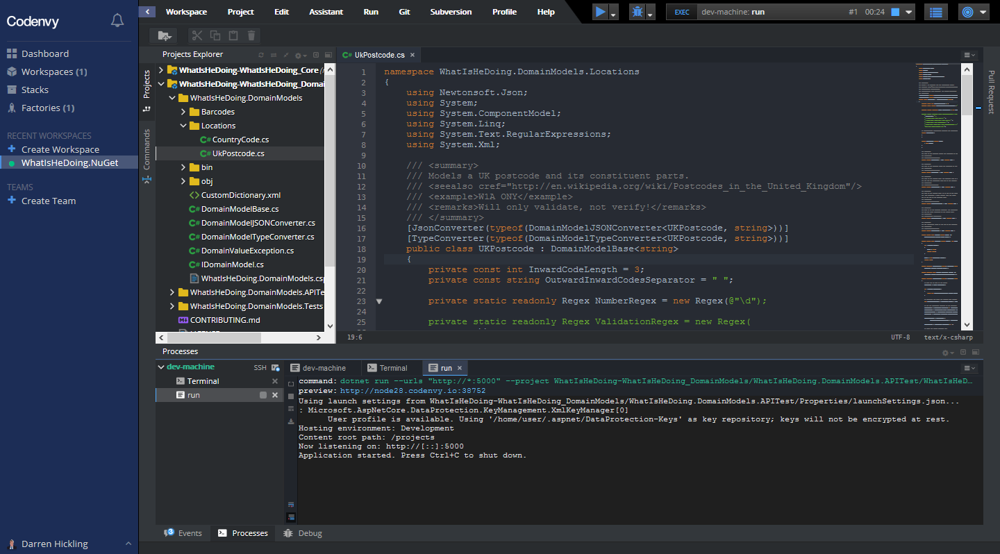

# WhatIsHeDoing.DomainModels

[][nuget]
[][nuget]
[][appveyor]
[](https://codecov.io/gh/WhatIsHeDoing/WhatIsHeDoing.DomainModels)
[][travis]
[][factory]

A library of domain models for .NET.

## 👋 Introduction

As the [Wikipedia] article explains:

> A domain model is a system of abstractions that describes select aspects of a sphere of knowledge, influence,
> or activity (a domain). The model can then be used to solve problems related to that domain. The domain model
> is a representation of meaningful real-world concepts pertinent to the domain that need to be modeled in software.
> The concepts include the data involved in the business and rules the business uses in relation to that data.

The domain models in this library implement a contract that ensures they are validated, serialised and
deserialised, in a consistent manner.

**Note**: these models only _validate_ their values, they do not _verify_ them. That is, a model value
can be in the correct format, but it might not exist! You may still need to use another means to verify them,
such as calling a service. For example, the UK postcode `SE1 9XX` is valid, but it does not [exist][royalmail].

## 📡 Demo

See how the Swagger demo site - use `dotnet run --project WhatIsHeDoing.DomainModels.APITest` -
handles URL, JSON and XML domain model de/serialisation.



## 🦮 Usage

### Installing

This package is available via [NuGet], and targets .NET Core 2.2 for cross-platform use.

### The Models

#### Barcodes

* `EAN`: [International Article Number][EAN]
* `ISBN`: [International Standard Book Number][ISBN]

#### Locations

* `CountryCode`: [two][cc1] and [three][cc2]-letter country codes.
* `UKPostcode`: United Kingdom [postcode]

## An Example

Let's say you are capturing the address of user in the United Kingdom in a web form, and posting it
to a .NET Web API. The postcode is a mix of alphanumeric characters, often separated by a space, so
why not simply use a `string`?

```C#
public class Address
{
    public string Line1 { get; set; }
    public string Line2 { get; set; }
    public string Town { get; set; }
    public string Country { get; set; }
    public string Postcode { get; set; }
}
```

### The Problems

Whilst a postcode looks simple enough, it is comprised of multiple different components, and is validated by a
suprisingly complex regular expression. If it is stored as a `string`, when is it validated, and where does
that logic reside? If it is passed to a Web API, you could add a model annotation, but what about other scenarios,
such as console and mobile apps? What happens when we need to access only parts of that postcode, such as
the postcode area, which could be used to determine whether the user is based in [Northern Ireland][postcodes]?

### Using a Domain Model

Capturing the same information in a domain model is as simple as switching to the `UKPostcode` type:

```C#
public class Address
{
    // As before, but now:
    public UKPostcode Postcode { get; set; }
}
```

Now, when the data is passed to the service, we can check the `ModelState` as usual, before moving on:

```C#
namespace Test
{
    using Microsoft.AspNetCore.Mvc;
    using Models;
    using System.Net;
    using WhatIsHeDoing.DomainModels.Locations;

    [Route("api/[controller]")]
    public class UserDetailsController : Controller
    {
        /// <summary>
        /// Does something useful with an address.
        /// </summary>
        /// <param name="address">Address to use</param>
        /// <returns>Success</returns>
        [HttpPost]
        [ProducesResponseType(typeof(string), (int)HttpStatusCode.OK)]
        [ProducesResponseType((int)HttpStatusCode.BadRequest)]
        public IActionResult Post(Address address) => ModelState.IsValid
            ? Ok(address.Postcode.PostcodeArea)
            : (ActionResult)new BadRequestResult();
    }
}
```

This works for both JSON (using [Json.NET]) and XML serialisation.

The underlying `Value` type is a `string`, and the model provides an implicit string operator override,
as you can see from unit tests like this from the `WhatIsHeDoing.DomainModels.Test` project:

```C#
[Fact]
public void StringFormat()
{
    var postcode = new UKPostcode("SW1 1AA");
    var actual = $"Hello from {postcode}!";
    Assert.Equal("Hello from SW1 1AA!", actual);
}
```

## 🆘 Contributing

All contributions are greatly welcomed! Please see the [contributing] guide for more information.

If you are developing locally, pull down this repo and build within Visual Studio (any edition), or
run `dotnet test` on any platform; the `master` branch is continuously built on both [Windows][appveyor]
and [Linux][travis]. Alternatively, simply create a new Codenvy workspace from my [factory]!
You can even run the API test project by simply using the `Run` :arrow_forward: feature; just click the
dynamic `preview` URL it generates in the terminal.



## 👱 Authors

* **Darren Hickling**: https://darrenhickling.com/, [@DarrenHickling]

[@DarrenHickling]: https://twitter.com/DarrenHickling "Darren Hickling (@DarrenHickling) | Twitter"
[appveyor]: https://ci.appveyor.com/project/DarrenHickling/whatishedoing-domainmodels-j4bij
    "WhatIsHeDoing.DomainModels - AppVeyor [Windows build]"
[cc1]: https://en.wikipedia.org/wiki/ISO_3166-1_alpha-2
[cc2]: https://en.wikipedia.org/wiki/ISO_3166-1_alpha-3
[contributing]: CONTRIBUTING.md
[EAN]: https://en.wikipedia.org/wiki/International_Article_Number
[factory]: https://codenvy.io/f?id=factorydoivwyk603gvrx9x "Start development on Codenvy"
[ISBN]: https://en.wikipedia.org/wiki/International_Standard_Book_Number
[Json.NET]: https://www.newtonsoft.com/json
[NuGet]: https://www.nuget.org/packages/WhatIsHeDoing.DomainModels/
[postcode]: http://en.wikipedia.org/wiki/Postcodes_in_the_United_Kingdom
[postcodes]: https://www.townscountiespostcodes.co.uk/postcodes-in-northern-ireland/
    "Postcodes in Northern Ireland | Northern Ireland Postcode Information, UK"
[royalmail]: https://www.royalmail.com/find-a-postcode "Postcode Finder - Find an Address | Royal Mail Group Ltd"
[travis]: https://travis-ci.org/WhatIsHeDoing/WhatIsHeDoing.DomainModels
    "WhatIsHeDoing/WhatIsHeDoing.DomainModels - Travis CI [Linux build]"
[untappd]: https://untappd.com/user/WhatIsHeDoing
[Wikipedia]: https://en.wikipedia.org/wiki/Domain_model
